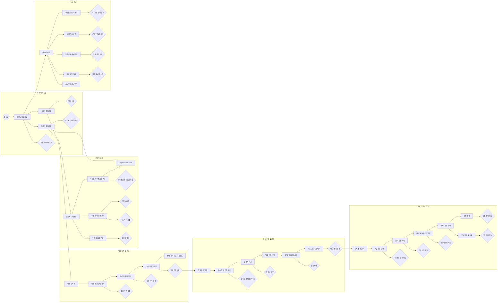

```mermaid
flowchart LR

  subgraph s1 ["인증 및 온보딩"]
    n1(("앱 진입"))
    n2["온보딩/회원가입"]
    n3["소비자 회원가입"]
    n4["공급자 회원가입"]
    n5{"이메일/SNS 로그인"}
    n6{"역할 선택"}
    n7{"소유권 주장(Claim)"}
  end

  subgraph s2 ["업체 탐색 및 비교"]
    n8["업체 검색 홈"]
    n9["다중 조건 필터 검색"]
    n10["업체 목록(카드뷰)"]
    n11["업체 상세 프로필"]
    n12["정량 신뢰 지표 대시보드"]
    n13{"필터 조건 설정"}
    n14{"업체 카드 선택"}
    n15{"견적 요청 담기"}
  end

  subgraph s3 ["견적 요청 및 계약"]
    n16["견적 요청/계약"]
    n17["복수 견적 요청 발송"]
    n18["견적서 비교"]
    n19["업체 선택 확정"]
    n20["마일스톤 계약 서명"]
    n21["에스크로 대금 예치"]
    n22{"동시 견적 발송(최대5)"}
    n23{"견적서 검토"}
    n24{"전자서명"}
    n25{"대금 예치 결제"}
  end

  subgraph s4 ["공사 진행 및 감리"]
    n26["공사 진행 관리"]
    n27["마일스톤 현황"]
    n28["감리 일정 예약"]
    n29["현장 체크리스트 입력"]
    n30["QA 리포트 확인"]
    n31["분쟁 신청"]
    n32{"마일스톤 완료 확인"}
    n33{"감리 일정 확정"}
    n34{"체크리스트 제출"}
    n35{"분쟁 증빙 첨부"}
    n36["공사 완료 및 리뷰"]
    n37{"인증 리뷰 작성"}
  end

  subgraph s5 ["공급자 관리"]
    n38["공급자 대시보드"]
    n39["프로필/포트폴리오 관리"]
    n40["라이선스 인증 업로드"]
    n41["수신 견적 요청 관리"]
    n42["노출 패키지 구매"]
    n43{"포트폴리오 이미지 등록"}
    n44{"견적서 제출"}
    n45{"리드 수락/거절"}
    n46{"패키지 결제"}
  end

  subgraph s6 ["어드민 운영"]
    n47["어드민 패널"]
    n48["라이선스 심사 관리"]
    n49["리뷰 모니터링"]
    n50["분쟁 중재 대시보드"]
    n51["감리 일정 관리"]
    n52["KPI 통계 대시보드"]
    n53{"라이선스 승인/반려"}
    n54{"콘텐츠 필터/삭제"}
    n55{"중재 결정 처리"}
    n56{"감리 재예약 승인"}
  end

  n1 --> n2
  n2 --> n3
  n2 --> n4
  n2 --> n5
  n3 --> n6
  n4 --> n7
  n4 --> n40
  n3 --> n8
  n8 --> n9
  n9 --> n13
  n9 --> n10
  n10 --> n14
  n10 --> n11
  n11 --> n12
  n11 --> n15
  n15 --> n16
  n16 --> n17
  n17 --> n22
  n17 --> n18
  n18 --> n23
  n18 --> n19
  n19 --> n20
  n20 --> n24
  n20 --> n21
  n21 --> n25
  n25 --> n26
  n26 --> n27
  n27 --> n32
  n27 --> n28
  n28 --> n33
  n28 --> n29
  n29 --> n34
  n29 --> n30
  n30 --> n31
  n31 --> n35
  n30 --> n36
  n36 --> n37
  n4 --> n38
  n38 --> n39
  n38 --> n41
  n38 --> n42
  n39 --> n43
  n39 --> n40
  n41 --> n44
  n41 --> n45
  n42 --> n46
  n2 --> n47
  n47 --> n48
  n47 --> n49
  n47 --> n50
  n47 --> n51
  n47 --> n52
  n48 --> n53
  n49 --> n54
  n50 --> n55
  n51 --> n56
```
